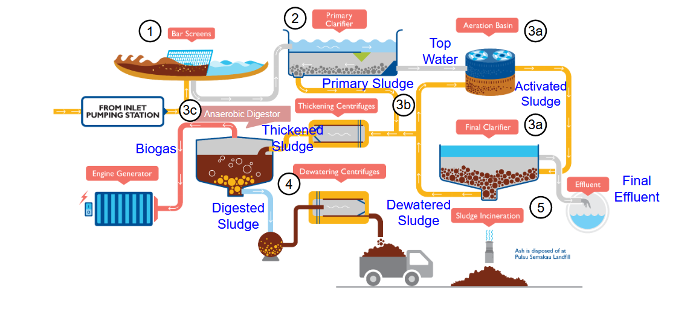

# 12_1_Used Water Treatment

## Total Solids (TS)

- **Total solids** in used water consist of:
    - Organic matter
    - Inorganic matter
    - Suspended material
    - Dissolved material
    - Settleable material
- **Impact**:
    - Affects color, odor, and turbidity of water.
- **Classification**:
    - Based on size, chemical composition, and settleability.

### Classification of Total Solids (TS)

- **Total Solids (TS)**: Measured in mg/L or %.
    - Split into:
        - **Suspended Solids (TSS)** – Non-filterable
        - **Dissolved Solids (TDS)** – Filterable
        - **Fixed Solids**: Inorganic matter
        - **Volatile Solids**: Organic matter

### Imhoff Cone

- Used to separate **settleable solids** from **suspended solids**.
- Visual tool to quantify settleability of solids in water.

## Solids Determination

### Procedure to Determine Solids in Used Water

- **Filtration**:
    - **Filter Cake** (solids that can't pass): Suspended solids (TSS)
    - **Filtrate** (liquid that passes): Dissolved solids (TDS)

- **Burning away volatiles**
    - Both portions are evaporated and then heated in an **oven at 550°C**.
    - Volatile (organic) solids burn away
    - Fixed (inorganic) solids stay behind

### Classification Breakdown

#### Suspended Solids (TSS)

- Determined from filter cake.
- Post-heating:
    - **FSS**: Fixed Suspended Solids (Inorganic)
    - **VSS**: Volatile Suspended Solids (Organic)  
        - *VSS = TSS – FSS*

#### Dissolved Solids (TDS)

- Determined from filtrate.
- Post-heating:
    - **FDS**: Fixed Dissolved Solids (Inorganic)
    - **VDS**: Volatile Dissolved Solids (Organic)  
        - *VDS = TDS – FDS*

### Total Solids Breakdown

- **Total Volatile Solids (TVS)** = VDS + VSS
- **Total Fixed Solids (TFS)** = FDS + FSS
- **Total Solids (TS)** = TVS + TFS

## Characteristics of Used Water – Organic Matter

- **Organic matter** (OM) is a mixture of organic compounds (proteins, carbohydrates and lipids)
- We measure the oxygen intake of microbes in the water to determine its density, it experiences exponential decay
    - **Biochemical oxygen demand** (BOD; mg/L) measures the amount of oxygen consumed at the end of 5 to 7 days by microorganisms in the biochemical stabilization of biodegradable organic matter
    - **Chemical oxygen demand** (COD; mg/L) represents the quantity of oxygen required to chemically oxidize and stabilize carbonaceous organic matter using strong oxidizing agents under acidic conditions

## Used Water Treatment Process

The process consists of **four main stages**:

1. **Preliminary** – Physical removal of coarse solids  
2. **Primary** – Physical removal of settleable solids  
3. **Secondary** – Biological removal of organic matter (OM)  
4. **Tertiary** *(rare)* – Biological or chemical removal of specific toxic pollutants  

## Removal Efficiency Formula

The **removal efficiency** $E$ (in %) of each stage is calculated as:
$$
E = \frac{C_o - C_e}{C_o} \times 100\%
$$

- Where:  
    - $C_o$ = Influent concentration of the pollutant (mg/L)  
    - $C_e$ = Effluent concentration of the pollutant (mg/L)

## Summary of Key Terms & Formulas

| Term | Description |
|------|-------------|
| TS | Total Solids |
| TSS | Total Suspended Solids |
| TDS | Total Dissolved Solids |
| FSS | Fixed Suspended Solids |
| VSS | Volatile Suspended Solids |
| FDS | Fixed Dissolved Solids |
| VDS | Volatile Dissolved Solids |
| TVS | Total Volatile Solids = VDS + VSS |
| TFS | Total Fixed Solids = FDS + FSS |
| TS | Total Solids = TVS + TFS |
| OM | Organic matter |
| BOD | Biochemical oxygen demand |
| COD | Chemical oxygen demand |

## Used Water Treatment Process in SG

1. Preliminary Treatment – Bar Screens (Physical removal of coarse solids)
   - Removes debris and sandy material from used water using mechanical screens and settling tanks
   - Settled solids (SS) level decreases
2. Primary Treatment – Primary Clarifier (Physical removal of settleable solids)
   - Settling of solid pollutants in suspension to the bottom of the tank while scum and greasy materials float to the top.
   - **Settled solids (primary sludge)** are collected and removed by scrappers while top water leaves for secondary treatment
   - Can be enhanced by adding coagulants
   - SS and BOD levels decreases
3. (3a) Secondary Treatment – Aeration Basin and Final Clarifier (Removal of OM)
   - **Microorganisms (activated sludge)** absorbs and breaks down organic pollutants in the top water in the aeration tank
   - Fine air bubbles in the aeration tank provides dissolved oxygen to sustain biological activities
   - Microorganisms settle at the bottom of the final clarifier
   - Some is constantly fed back to the aeration tank as activated sludge while the remaining is sent for further treatment
   - Clear supernatant water (final effluent) is collected at the top of the final clarifier
   - BOD level decreases
   - **Final effluent can be**
     - Discharged into the sea/ocean
     - Further disinfected and supplied to industries
     - Further treated using reverse osmosis to make NEWater
4. (3b) Sludge Thickening – Thickening Centrifuges
   - Water content in the primary sludge and excess activated sludge is reduced by thickening and centrifuging
   - Thickened sludge is fed to anaerobic digestors for further treatment
   - **Thickened sludge = primary sludge + activated sludge**
5. (3c) Sludge Digestor – Anaerobic Digestor (Recycle organic matter in sludge to produce biogas, a form of energy)
   - Anaerobic microorganisms (**oxygen deficient**) breaks down organic matter in thickened sludge to produce biogas (methane rich)
   - Biogas is used as a fuel to produce electrical power to help power the plant
   - Wet digested sludge is removed for further treatment
6. (4) Sludge Dewatering – Dewatering Centrifuges
   - Reduction in water content in the wet digested sludge through mechanical means to produce dewatered sludge
7. (5) Sludge Incineration
   - Dewatered sludge is incinerated to produce ash, which is then disposed at Pulau Semakau Landfill

### Anaerobic Sludge Digestion

- Anaerobic digestion (also known as sludge stabilization) is:
    - The decomposition of organic matter (OM) by microorganisms.
    - Occurs in an oxygen-free (O₂-free) environment.
    - Produces stable and inert solids and biogas.
- Process takes place in a sludge digester with thickened sludge:
- Composition:
    - 45% to 65% organic matter (OM)
    - 25% to 55% inorganic material
- Biogas production:
    - Approximately 70% methane (CH₄)
    - Around 30% carbon dioxide (CO₂)
    - Trace amounts of inert gases
- Volume Reduction:
    - The volume of sludge can be reduced by up to 50%-
- General Reaction: Organic Matter (OM) + Microorganisms → CO₂ + CH₄ + NH₄⁺ + PO₄³⁻ + other byproducts
- CO₂ (Carbon Dioxide):
    - Most oxidized form of carbon
    - No energy value
- CH₄ (Methane):
    - Most reduced form of carbon
    - Has energy value (can be harnessed as renewable energy)

## Biogas - Methane Estimation

- Oxidation of Methane: CH₄ + 2O₂ → CO₂ + 2H₂O
    - 1 mol (16g) of CH₄ needs 2 mols (64g) of O₂ for complete oxidation
    - This corresponds to removing 64g of COD from wastewater
    - 1 kg COD corresponds to 0.25kg of methane
- Maximum theoretical production of methane per gram of COD removed:

$$
V_{CH_4}=\frac{COD_{CH_4}}{K_t}
$$

- Where
    - $V_{CH_4}$: Volume of methane produced (in liters, L)
    - $COD_{CH_4}$: Chemical Oxygen Demand (COD) load removed from the reactor and converted to methane (in grams, g)
    - $K_t=\frac{64P}{RT}$: Correction factor for the operational temperature of the reactor (units: g COD/L)
    - $P$ = reactor pressure (atm)
    - $R$ = universal gas constant = 0.08206 atm.L/mol.K
    - $T$ = reactor temperature (K)
