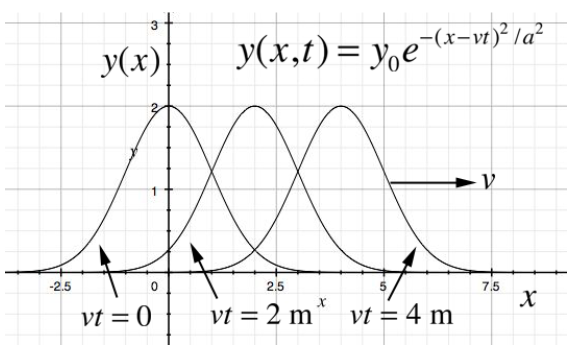
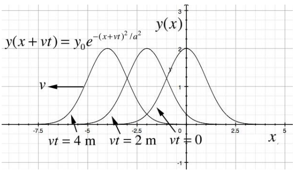
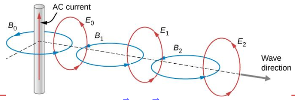

# 13_Wave Equations

## 1D Wave Equation

In general, a wave equation is a partial differential equation with the following form:
$$\frac{1}{v^2}\frac{\partial^2y(x,t)}{\partial d^2}=\frac{\partial^2y(x,t)}{\partial x^2}$$

- $y(x, t)$ is a function of position, $x$ and time, $t$.
    - This function is what we want to find out
    - It is the solution of this wave equation
- $v^2$ is a constant, where $v$ is the speed of the wave.
- It turns out that the general solution needs to be:
$$y(x,t)=y(x\pm vt)$$
- This function, $y(x\pm vt)$ is called travelling function/wave.
- **Any functions** of $y (x + vt)$ or $y(x - vt)$ or a linear combination of both (superposition principle) **is a solution of the one-dimensional wave equation**.

## Travelling function, $f(x\pm vt)$

- $f(x-vt)$ is a right travelling function
    - corresponds to a wave traveling in the positive $x$-direction with speed $v$
     
- $f(x+vt)$ is a left travelling function
    - corresponds to a wave traveling in the negative $x$-direction with speed $v$
     
- "Traveling" means that the shape of these individual arbitrary functions with respect to x stays constant, however the functions are translated left and right with time at the speed v.

$$
y(x,t)=y_{0}\sin[k(x-ct)]=y_{0}\sin(k x-\omega t)
$$

- Periodicities
    - Spacial period: Wavelength, $\lambda$ - Time is fixed
    - Temporal period: Period, $T$ - Position is fixed
- Wavenumber, $k = \frac{2\pi}{\lambda}$ - Number of waves in 2π
- Angular frequency: $\omega = 2\pi f$
- Dispersion relation, $\lambda = cT \implies \omega = kc$
- Frequency, $f = \frac{1}{T}$
- Velocity, $v = f\lambda$

## EM Wave Equations

- EM waves consist of both an electric and magnetic field
- In a plane EM wave, the two waves are perpendicular in direction of propagation
- Equation relating the two waves is given by

$$
\frac{\partial E_y}{\partial x} = -\frac{\partial B_z}{\partial t} \\
-\frac{\partial B_{z}}{\partial x}=\mu_0\varepsilon_0\frac{\partial E_{y}}{\partial t}
$$

- Equation relating space and time for electric field

$$
{\frac{\partial^{2}E_{y}}{\partial x^{2}}}=\mu_{0}\varepsilon_{0}\,{\frac{\partial^{2}E_{y}}{\partial t^{2}}} \\
\vec{E}(x,t)=E_{0}\,\mathrm{sin}\,k(x-c t)\,\hat{j}\ =E_{0}\,\sin(k x-\omega t)\,\hat{j}
$$

- Equation relating space and time for magnetic field

$$
\frac{\partial^{2}B_{z}}{\partial x^{2}}=\mu_{0}\varepsilon_{0}\frac{\partial^{2}B_{z}}{\partial t^{2}} \\
\vec{B}(x,t)=B_{0}\,\sin k(x-c t)\,\hat{k}=B_{0}\,\sin(k x-\omega t)\,\hat{k}
$$

## Poynting Vector

- Poynting Vector $\vec{S}$: **direction of energy flow = direction of wave propagation**

$$
\vec{S}=\frac{\vec{E}\times \vec{B}}{\mu_{0}}
$$

- Unit: Watts per square metre

### Proof

- $E=cB$ for electromagnetic waves
- $c=\frac{1}{\sqrt{\mu_{0}\epsilon_{0}}}$
- Energy densities, $u_E=\frac{1}{2}\epsilon_{0}E^{2}$, $u_B=\frac{1}{2\mu_0}B^2$
- Consider cylinder:
- $dU=(u_E+u_B)Adz=\frac 12\left( \epsilon_0E^2+\frac{B^2}{\mu_0} \right)Acdt$
- Rate of energy flow per unit area:
- $S=\frac{1}{A} \frac{dU}{dt}=\frac{c}{2}\left( \epsilon_0E^2+\frac{B^2}{\mu_0} \right)=\frac{c}{2}\left( \epsilon_0cEB+\frac{EB}{c\mu_0} \right)$
- $=\frac{EB}{2\mu_0}(\epsilon_{0}\mu_{0}c^{2}+1)$
- $=\frac{EB}{\mu_0}\implies \vec{S}=\frac{\vec{E}\times \vec{B}}{\mu_0}$
TODO: Case Problems

## Electromagnetic Spectrum

Wavelength and frequency are related by:
$$ c=f\lambda $$

## Polarisation of Light

Malus’s law, polarised light passing through an analyser (the second polariser)
$$ I=I_{max}\cos^2\phi $$
