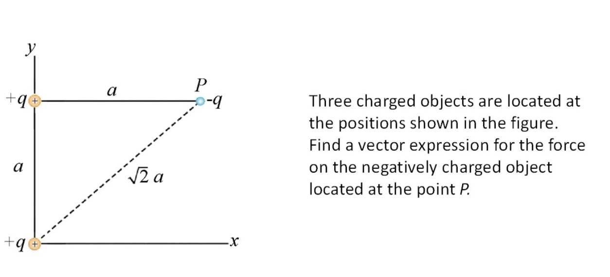

# 1_1_Charges and Electricity

## Fundamental physical principles

- Electromagnetic Fields and their properties and interaction
- Lorentz Force Law: $\vec{F}=q(\vec{E}+\vec{v}\times \vec{B})$
- Maxwell's Equations

## Charges and the Conservation of Charges

- Two types of charges: positive and negative
- **Like** charges **repel**, **opposite** charges **attract**
- Atoms:
  - **negatively charged electrons**
  - **positively charged protons**
  - neutral neutrons
  - A **neutral** atom has an **equal number** of electrons and protons.
  - Due to the random motion of electrons, charge distribution may become uneven. The region where **more electrons** are concentrated is **more negatively** charged while the remaining part of the atom is positively charged.
  - Water is a permanent dipole: electrons permanently concentrate in the oxygen molecule.
- Charge is the **source of electromagnetic interaction**, 2 charges can electrostatically attract or repel.
- **Conservation of charge in a closed system**: total amount of charge always remains the same. Charges cannot be created or destroyed, charges can only be transferred and moved from one body to another.
- Ways of charging a body:
  - touching
  - friction
  - induction

### Van de Graaff Generator

- Bouncing ball:
  - When a ball is placed between a Van de Graaff generator and a grounded object, it bounces between the generator and the grounded object.
  - The ball is induced with negative charge near the Van de Graaff dome and positive charge at the side away from the dome.
  - Ball gets attracted to dome
  - Upon touching the dome, the negative charge is neutralised with the positive charge on the dome, leaving net positive charge on the ball.
  - Ball is repelled from the dome.
  - Upon touching the grounded object, the positive charge is neutralised. By gravity, the ball falls back towards the dome, restarting the cycle.
- Flying aluminium cup when placed on top of the Van de Graaff generator:
  - Same process as above, but since there is no grounding object near the dome, the cups fly off.

## Interactions of Point Charges and Coulomb's Law

### Point Charge

- **Representation** of **any charged object** with **negligible size, shape, structure etc**.
- **Simplest charged entity** that can participate in electrical interactions.
- So, an electron an be considered a "point" with finite charge but no interior structure.
- There is no such thing as a point charge in reality, but this concept is a good approximation for a charged object if it is sufficiently far away from the observer.

### Coulomb's Law

- The force on point $q_2$ due to interaction with point charge $q_1$ is proportional to the product of charges and inversely proportional to the square of the distance of separation.
$$\vec{F}_{12}=k_e\frac{q_1q_2}{r_{12}^2}\hat{r}_{12}$$
- **If the interaction happens in vacuum: $k_{e}=\frac{1}{4πε_0}\approx 9\times 10^{9}Nm^2/C^2$, where $ε_0$ is the permittivity of free space.**
- Because $\hat{r}_{12}=\frac{\vec{r}_{12}}{r_{12}}$, Coulomb's law can also be written as
$$\vec{F}_{12}=k_e\frac{q_1q_2}{r_{12}^3}\vec{r}_{12}$$
**Note the cube in the denominator.**

### Principle of Superposition for Coulomb Force

- The total Coulomb force on a charge $q_0$ from many charges around it is

$$
\vec{F_{0}}=\sum_{i=1}^n\vec{F}_{i_0}=\sum_{i=1}^nk_e\frac{q_iq_0}{r_i^2}\hat{r}_i
$$

- Example: 

$$\begin{align*}
\vec{F}_{23}&=k_e \frac{q_2q_3}{r_{23}^{2}}\hat{r}_{23} \\
&=-k_e \frac{q^2}{a^2}\hat{i} \\
\vec{F}_{13}&=k_e \frac{q_1q_3}{r_{13}^{3}}\vec{r}_{13} \\
&=-k_e \frac{q^2(a\hat{i}+a\hat{j})}{(\sqrt{2}a)^3} \\
&=-k_e \frac{q^2}{(2\sqrt{2}a)^2}
\end{align*}
$$
