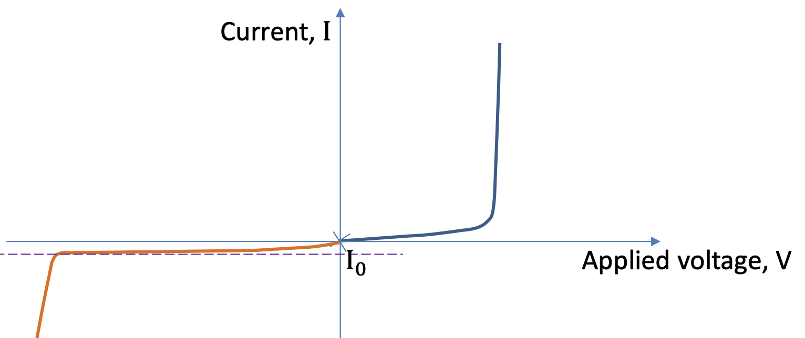

# W8 - Current and Voltage

| Name                                | Symbol        | Description                                                                 |
|-------------------------------------|---------------|-----------------------------------------------------------------------------|
| Short-circuit current/photocurrent | $I_{sc}$      | Current during a short circuit when resistance is zero. Maximum current output of the PV cell |
| Open-circuit voltage                | $V_{oc}$      | Voltage during an open circuit when resistance is at maximum. Maximum voltage output of the PV cell |
| Maximum power                       | $P_{max}$     | Maximum power output of the PV cell                                         |
| Maximum power point                 | MPP           | The point on the I-V curve at which the PV cell will generate the most power |
| Voltage at MPP                      | $V_{mp}$      | The PV cell voltage at the MPP                                              |
| Current at MPP                      | $I_{mp}$      | The PV cell current at the MPP                                              |

Modelled as
$$
I_D=I_0\left(e^{\frac{qV}{k_BT}}-1\right)
$$

- Where
    - $I_0$: reverse saturation current
    - $q$: charge of an electron
    - $V$: voltage across the solar cell
    - $k_B$: Boltzmann constant
    - $T$: temperature in Kelvin
- When a photon above the bandgap collides with an electron in the depletion region, an electron-hole pair is formed, which causes a charge imbalance.
- If an electron-hole pair is not generated in the depletion region, they will immediately recombine, thus no voltage is produced.
