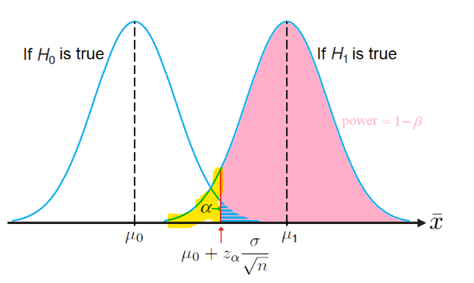

# W11D2 - p-value; Power

## p-value

- **p-value**: What is the probability of observing a sample statistic **at least as extreme** as the one observed, assuming that $H_0$ is true? For the case of a one sided tail,
    - if $p <= \alpha$, we reject $H_0$
        - A low p-value indicates the data is *too surprising* under the assumption that $H_0$ is true, so an alternative explanation would be that $H_0$ is false
        - The **smaller** the p-value, the more **significant** the test result as there is more evidence against $H_0$ for $H_1$
        - p-value is also the smallest $\alpha$ at which $H_0$ can be rejected
    - if $p > \alpha$, we do not reject $H_0$

- If $H_1: \mu\neq\mu_0, \textsf{p-value}=2\mathbb{P}\left(Z\geq \left|\frac{\bar{x}-\mu_0}{\sigma / \sqrt{n}}\right|\right)$
- If $H_1: \mu>\mu_0, \textsf{p-value}=\mathbb{P}\left(Z\geq\frac{\bar{x}-\mu_0}{\sigma / \sqrt{n}}\right)$
- If $H_1: \mu<\mu_0, \textsf{p-value}=\mathbb{P}\left(Z\leq\frac{\bar{x}-\mu_0}{\sigma / \sqrt{n}}\right)$

## Power

- **Power** is $1-\beta$ where $\beta$ is the probability of making a type II error.
- **Formulas**:
    - When testing $H_0:\mu=\mu_0$ vs $H_1:\mu>\mu_0$, the formula is
  $$1-\beta=\Phi\left(\frac{\textcolor{red}{\mu_1-\mu_0}}{\sigma / \sqrt{n}}-z_{1-\alpha}\right)$$
    - When testing $H_0:\mu=\mu_0$ vs $H_1:\mu<\mu_0$, the formula is
  $$1-\beta=\Phi\left(\frac{\textcolor{red}{\mu_0-\mu_1}}{\sigma / \sqrt{n}}-z_\alpha\right)$$

- Where $\beta$ is the region in **yellow**
- It is **not possible** to simultaneously reduce the probabilities of both types of errors $\alpha$ and $\beta$
    - The only way is to increase sample size $n$
