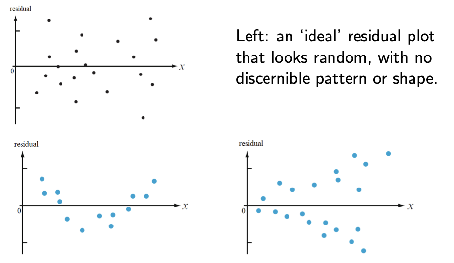

# W13D1 - Linear Regression

## Probabilistic model

The linear regression equation in the probabilistic model is:
$$
Y_i=\beta_0+\beta_1x_i+\epsilon_i
$$
where:

- $\beta_0$ and $\beta_1$ are the constants of linear regression, and
- the $\epsilon_i$'s are (treated as) independent normal random variables, each with mean $0$ and variance $\sigma^2$; that is, $\epsilon_i \sim \mathcal N(0, \sigma^2)$.

## Residuals

- A residual is defined as $e_i:=y_i-\hat{y}_i$
- The residuals approximate observed values of the $\epsilon_i$’s, and are hence used to check model assumptions.
- This is done using a scatter plot of $(x_i, e_i)$, known as a residual plot.

Bottom plots:

- Left: The parabolic shape of the residual plot indicates a possible need for an $x^2$ term in the model.
- Right: the vertical spread of the residuals increases with $x$, violating the equal variance assumption.

## Mean squared error

$$
\begin{gather}
MSE = s^2 := \frac{1}{n-2} \sum_{i=1}^n (e_i)^2\\
R^2= \frac{\mathrm{SSR}}{\mathrm{SST}}=\frac{b_1^2S_{xx}}{S_{yy}}
\end{gather}
$$
where $S_{xx}=\sum(x_i-\bar{x})^2$. From that we can solve for $S_{xx}$ and then get $s_x^2=S_{xx}/(n-1)$.

## Confidence Interval

Since $\hat{\beta}_1$ is an estiaate for the true slope $\beta_1$, we have
$$
\hat{\beta}_1 \sim \mathcal{N} \left( \beta_1, \frac{\sigma^2}{(n-1) s_x^2} \right)
$$
In simple linear regression, the $100(1-\alpha)\%$ two sided CI for $\beta_1$ is,
$$
\left[
\hat{\beta}_1 - t_{n-2, \alpha/2} \frac{s}{s_x \sqrt{n - 1}}, \
\hat{\beta}_1 + t_{n-2, \alpha/2} \frac{s}{s_x \sqrt{n - 1}}
\right]
$$

## Hypothesis Testing

- To test whether there is any relationship between $x$ and $Y$, the hypothesis can be formulated as $H_0: \beta_1 = 0$ vs $H_1: \beta_1 \neq 0$
- In simple linear regression, reject $H_0$ in favour of $H_1$ at significance level $\alpha$ iff **any** of the following is satisfied
    - $\frac{|\hat{\beta}_1|}{s / \left( s_x \sqrt{n - 1} \right)} > t_{n-2, \alpha/2}$
    - 0 is outside the CI range for $\beta_1$ given above
    - The p-value $2\mathbb{P}(T_{n-2} \geq \frac{|\hat{\beta}_1|}{s / \left( s_x \sqrt{n - 1} \right)})$ is less than $\alpha$

## Adjusted $r^2$

For multiple linear regression where $k > 1$, the adjusted $r^2$ is given by
$$
r^2_{adj} = 1 - \frac{n-1}{n-1-k}(1-r^2)
$$
