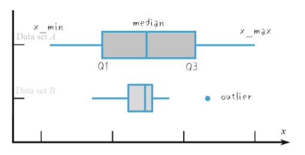

# W1D2 - Summarizing and Visualizing Data

## Measures of center

- **Sample mean**, $\bar{x}$ (x-bar)
    - Given the data values $x_1, x_2, \dots, x_n$, the **sample mean** $\bar{x}$ is defined as $$ \bar{x}=\frac1n\sum_{i=1}^nx_i $$
    - In Excel, the sample mean can be found using the `AVERAGE` command.
    - Identity between sample mean and data values:

$$
\sum_{i=1}^n(x_i-\bar{x})=0
$$

- **Sample median**, $\tilde{x}$ (x-tilde)
    - Can be computed in two steps:
    - Sort the values in increasing (or decreasing) order.
    - If $n$ is odd, then the median is the middle number of the sorted values; if $n$ is even, then the median is the average of the two middle numbers.
    - In Excel, the sample median can be found using the `MEDIAN` command.
- **Mode**
    - A **mode** is a value that appears most often in a data set.
    - Sometimes used as a measure of center, but this can be **problematic**, because:
        - A mode is not always located near the center.
        - There may be multiple modes.
    - For a graph, a mode refers to a peak in the graph.
    - If a graph has a **single peak**, then it is known as **unimodal**; if it has **two peaks,** then it is known as **bimodal**.
- **Skew**
    - A **unimodal** graph may be **symmetric** or **skewed**.
    - If it is **symmetric**, then the **mean, median and mode all coincide**.
    - If the **left tail of the graph is longer** (than the right tail), then the graph is said to be **skewed to the left**; if the **right tail is longer**, then the graph is **skewed to the right**.
    ![[skew.png]]

### Robustness

- The mean is sensitive to extremely large or extremely small values, while the median is not.
- We thus say that the **mean** is **not robust**, while the median is a **robust** statistic.

## Measures of Spread

### Sample variance

- Given the data values $x_1, x_2, \dots, x_n$, the **sample variance** $s_x^2$ is defined as

$$s_x^2=\frac{1}{n-1}\sum_{i-1}^{n}(x_i-\bar{x})^2$$

- The **sample standard deviation** of these data values is defined as

$$s_x=+\sqrt{s_x^2}$$

- **Not robust**

### Range

- The difference between the largest and smallest data values, $x_{max}-x{min}$

### Interquartile range (IQR)

- $Q_3-Q_1$, where:
    - $Q_3$ is the **median** of the **upper half** of the sorted data
    - $Q_1$ is the **median** of the **lower half** of the sorted data
    - If the number of data values is **odd**, the **median of the data** is **discarded** before dividing the data into halves.
- **Robust**
- **There is no universally accepted definition for $Q_1$, $Q_3$ and IQR.**

### Box plot

- **Five-number summary** of a data set:
$$x_{min}, Q_1, \tilde{x}, Q_3, x_{max}$$
- **Width of the box**: $Q_1$ and $Q_3$
- **Line in the middle of the box**: $\tilde{x}$
- '**Whiskers**' are drawn from either end of the box to the **largest** and **smallest** data values that are **not outliers**.

### Outlier

- A data value that is 'distant' from the main body of data values.
- Reasons for occurring:
    - Measurement or recording errors
    - "Heavy" tails in a graph, in which case we should be cautious and not discard them.
- **No** clear-cut rules for detecting outliers.
    - In box plots, data values that are more than 1.5 IQR below Q_1 or more than 1.5 IQR above Q_3 are **generally** considered to be outliers.

## Bivariate numerical data

- A **scatter plot** is the standard way to visualize the data.

### Sample covariance and correlation

- The sample covariance $s_{xy}$ is defined as
$$s_{xy}=\frac{1}{n-1}\sum_{i=1}^{n}(x_i-\bar{x})(y_i-\bar{y})$$
- The sample correlation coefficient $r_{xy}$ is defined as
$$r_{xy}=\frac{s_{xy}}{s_{x}s_{y}}$$
where $s_x$ is the sample **SD** of the $x$ data, and $s_y$ is the sample **SD** of the $y$ data.
- In Excel, the commands are `COVARIANCE.S` and `CORREL` respectively.

### Contingency table

Data involving **two categorical variables** can be displayed in a contingency table.
Example:

|                | bachelor | master | PhD | row sum |
| -------------- | -------- | ------ | --- | ------- |
| hired          | 12       | 14     | 10  | 36      |
| not hired      | 38       | 21     | 5   | 64      |
| **column sum** | 50       | 35     | 15  | 100     |

The two variables are: the applicant’s highest level of education, and whether the applicant is hired.
