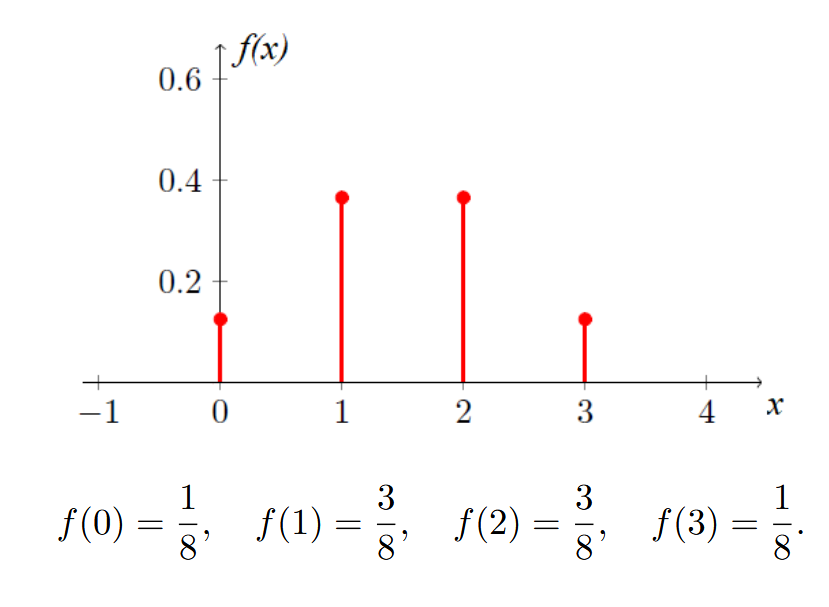
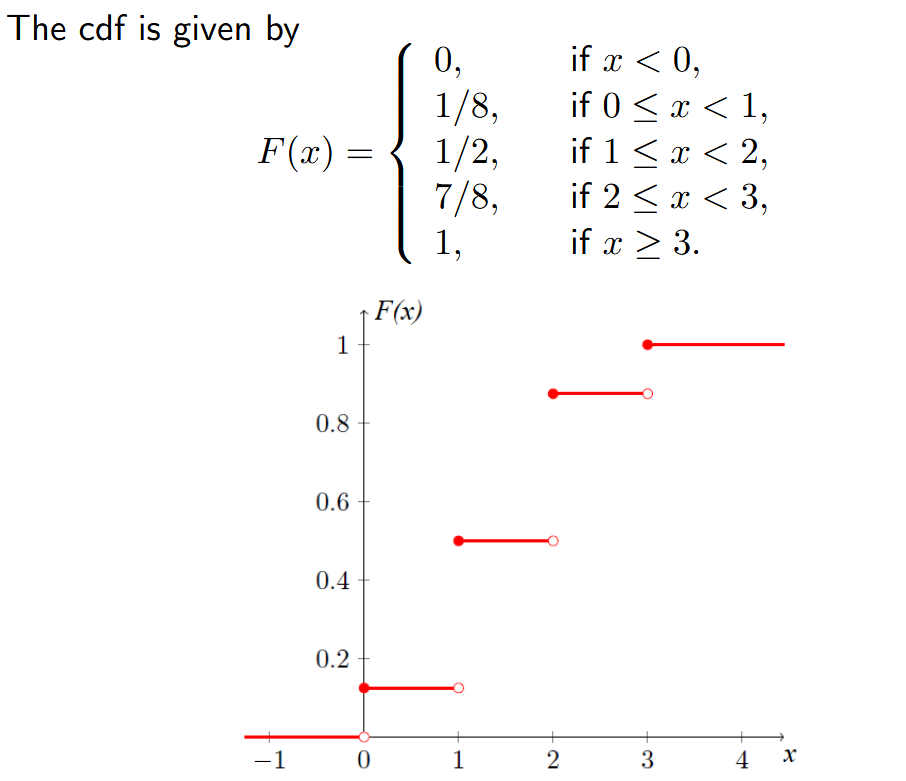

# W4D2 - Introduction to Random Variables
## Random variables
A **random variable (RV)** is a variable that represents each outcome of an experiment by a real number.

More formally, a random variable is **a function** from the sample space $\mathcal S$ of the experiment to the real line $\mathbb R$, mapping each outcome to a number.

Examples of **discrete** random variables:
- The sum of two dice rolls.
- The number of emails you receive in a day.
- The number of T's in n coin tosses.
- The square of the number of T's in n coin tosses.
- Half the number of H's in n coin tosses.
- Each Yes/No answer from a survey, represented by 1 and 0 respectively. The average of such random variables, which is yet another RV, gives the proportion of Yes answers.

Examples of **continuous** random variables:
- The time until a projector bulb expires.
- The height of a randomly selected student.
- The amount of water your household uses this month.

Discrete RVs are analysed using **algebra**, while continuous RVs are analysed using **calculus**.

*Example*:
> Toss a fair coin 3 times. Let the random variable X denote the number of T's obtained. Find the values that X can take, as well as their probabilities.
$$
\begin{align}
\mathbb P(X=0)&=0.5\times 0.5\times 0.5&=\frac{1}{8}\\
\mathbb P(X=1)&=0.5\times 0.5\times 0.5+0.5\times 0.5\times 0.5+0.5\times 0.5\times 0.5&=\frac{3}{8}\\
\mathbb P(X=2)&=0.5\times 0.5\times 0.5+0.5\times 0.5\times 0.5+0.5\times 0.5\times 0.5&=\frac{3}{8}\\
\mathbb P(X=3)&=0.5\times 0.5\times 0.5&=\frac{1}{8}
\end{align}
$$
## Probability mass function
For a discrete random variable $X$, its **probability mass function (pmf)**, denoted by $f(x)$, is defined as $$f(x):=\mathbb P(X=x)$$

  

*PMF for tossing a fair coin 3 times*
## Cumulative distribution function
For a discrete random variable $X$, its **probability mass function (pmf)**, denoted by $f(x)$, is defined as $$F(x):=\mathbb P(X\leq x)=\sum_{\forall x_i \leq x}f(x_i)$$
- $F$ is defined for **all** $x \in r$.
- $F$ is a **non-decreasing** function of $x$, and $0 \leq F(x) \leq 1$.
- For any **real constants** $u ≤ v$, $\mathbb P(u < X ≤ v) = F(v) − F(u)$.
  

  

*CDF for tossing a fair coin 3 times*
## Geometric random variable
 Models the probability of tries until the first success.

Recall that coin tosses are independent, so the probability mass function of a geometric $(p)$ random variable $X$, where $p$ is the probability of the desired outcome, is given by
 $$ f(n) = \mathbb{P}(X = n) = (1-p)^{n-1}p \text{ where } n = 1, 2, 3,\cdots $$
- **Expected value**, $\mathbb E(X)=\frac{1}{p}$
- **Variance**, $\mathrm{Var}(X)=\frac{1-p}{p^2}$