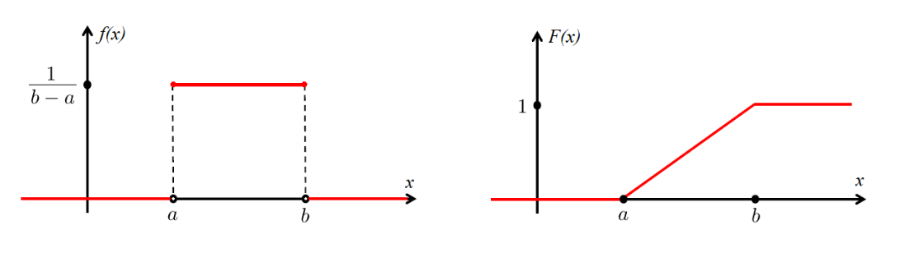

# W6D1 - Continuous Random Variables (CRV)

## Probability density function (PDF)

Probability density function (PDF) is defined by
$$
\begin{align}
\mathbb{P}(a\leq X\leq b)&=\int_{a}^{b}f(x)\,\mathrm{d}x \\
\mathbb{P}(X\in\mathbb{R})\ &= \int_{-\infty}^{\infty}f(x)\,\mathrm{d}x=1 \\
\mathbb{P}(X=a)&=\int_{a}^{a}f(x)\,\mathrm{d}x=0
\end{align}
$$

- It is **not necessarily true** that $f(x) \leq 1$

## Cumulative distribution function (CDF)

Cumulative distribution function (CDF) is given by
$$
F(x) = \mathbb{P}(X \leq x) = \int_{-\infty}^x f(t), dt
$$

- Note that by fundamental theorem of calculus, $F'(x) = f(x)$ which explains the integral
- **Domain** of $F(x)$ is always $\mathbb{R}$ (i.e $x \in \mathbb{R}$)
- $F(x)$ is a non-decreasing function of $x$
- $F(x)$ represents a probability
    - $0\leq F(x)\leq1$
    - $\operatorname*{lim}_{x\rightarrow-\infty}F(x)=0$
    - $\operatorname*{lim}_{x\rightarrow\infty}F(x)=1$
    - $\mathbb{P}(a<X\leq b)=F(b)-F(a)$
    - $\mathbb{P}(X > a)\ = 1 - F(a)$
- Since $X$ is a continuous random variable, any particular value is $0$
    - **It does not matter if we use $\leq$ or $<$**
    - **A probability of 0 does not literally mean its impossible, since the sample space is infinite**

## Expectation and Variance

$$
\begin{align}
\mathbb{E}(X) &= \mu_{X}:=\int_{-\infty}^{\infty}x\,f(x)\,\mathrm{d}x \\
\mathbb{E}(g(X)) &= \int_{-\infty}^{\infty}g(x)\,f(x)\,\mathrm{d}x \\
\operatorname{Var}(X)&=\sigma_{X}^{2}:=\mathbb{E}((X-\mu_{X})^{2})=\mathbb{E}(X^{2})-\mathbb{E}(X)^{2} \\
\mathbb{E}(aX+b)&=a\mathbb{E(X)}+b \\
\operatorname{Var}(aX+b)&=a^{2}\operatorname{Var}(X)
\end{align}
$$

### Uniform Distribution

Let $a$ and $b$ be constants (where $a < b$). A continuous random variable $X$ is said to satisfy a (continuous) uniform distribution on the interval $[a, b]$, if its pdf is given by
$$
f(x) = \begin{cases}
\frac{1}{b - a}, & \text{if } a \leq x \leq b \\
0, & \text{otherwise}
\end{cases}
$$
$$
F(x) = \begin{cases}
0, & \text{if } x < a \\
\frac{x-a}{b-a}, & \text{if } a \leq x \leq b \\
1, & \text{if } x > b
\end{cases}
$$

- This is a type of CRV
- Denoted by $X \sim \text{uniform} (a,b)$

$$
\begin{align}
\mathbb{E}(X) &= \frac{b+a}{2} \\
\text{Var}(X) &= \frac{(b+a)^2}{12}
\end{align}
$$

- PDF and CDF respectively of uniform distribution

HOMEWORK: Understand Integration by Parts

1. $\int_0^\infty x e^{-ax} \, dx$
2. $\int_0^m x e^{-ax} \, dx$
3. $\int_0^\infty x^2 e^{-ax} \, dx$
4. $\int_0^m x^2 e^{-ax} \, dx$
